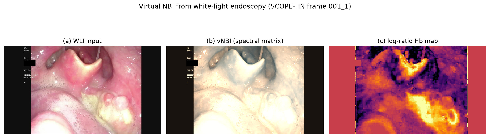

# virtual-nbi

**Virtual narrow-band imaging (vNBI) from white-light endoscopy — open-source, real-time, hardware-free.**



*(a) white-light input · (b) vNBI (spectral color-matrix) · (c) log-ratio hemoglobin map — SCOPE-HN frame 001_1)*

This package converts conventional white-light (WLI) endoscopic frames into
narrow-band-imaging (NBI)-like images by re-weighting the WLI RGB signal into
the NBI spectral range. It is the code companion of:

> Lin J-H, Chen L-F, Yang M-H. *AI-Based Conversion of White-Light Endoscopy to
> Narrow-Band Imaging: Virtual NBI with Open-Source, Real-Time Code* (2026).

---

## Why virtual NBI?

- **Most hospitals and image archives are WLI-based.** NBI-capable endoscopes are
  expensive and not universally available; retrospective archives are
  overwhelmingly white-light.
- **NBI carries diagnostic value WLI lacks.** NBI restricts illumination to
  ~415 nm (blue; superficial mucosal microvasculature) and ~540 nm (green;
  deeper vessels), enhancing hemoglobin contrast and providing
  microvascular-pattern information that improves **specificity** (e.g.,
  91.3% vs 51.3% in Wang et al., *Laryngoscope* 2024).
- **vNBI extracts that information from WLI.** The spectral content of a WLI
  RGB frame partially overlaps the NBI absorption bands, so it can be
  re-weighted into NBI-like channels — no additional hardware.

## What's inside

| Module | Description |
|---|---|
| `virtualnbi/transforms.py` | Five spectral transforms: `channel` (band re-weighting), `log_ratio` (hemoglobin-contrast maps), `matrix` (fixed 3x3 spectral color matrix, **default display output**), `ica` (independent-component decomposition), `frangi` (vesselness) |
| `virtualnbi/pipeline.py` | Frame-synchronized pipeline + torch tensor builder (RGB + vNBI channels) for deep-learning consumption |
| `examples/demo_convert.py` | Single image / folder / video → synchronized `WLI \| vNBI` output |

## Installation

```bash
pip install -r requirements.txt        # numpy, Pillow (scikit-image optional)
# or, from the repository root:
pip install -e .
```

## Quick start

```python
import numpy as np
from PIL import Image
from virtualnbi import VirtualNBI

wli = np.asarray(Image.open("frame.png").convert("RGB"), dtype=np.float32) / 255.0
vnbi = VirtualNBI(method="matrix", n_out=3)(wli)   # (H, W, 3), the display output
```

### Demo script

```bash
# single image -> compare.png (left: WLI | right: vNBI)
python examples/demo_convert.py path/to/wli.jpg

# folder of frames
python examples/demo_convert.py path/to/frames/ --out output/

# video -> synchronized GIF (uses ffmpeg for frame extraction)
python examples/demo_convert.py video.mp4 --video --out realtime.gif
```

## Real-time performance

Per-frame conversion latency at 1920×1080 on a standard CPU (mean of 50 runs):

| Algorithm | Latency | Throughput |
|---|---|---|
| band re-weighting (`channel`) | 58.8 ms | 17 fps |
| spectral color matrix (`matrix`) | 82.1 ms | 12 fps |
| log-ratio hemoglobin maps | 271.8 ms | ~4 fps |
| Frangi vesselness | 19.2 s | offline / supervision signal |

## Quantitative evidence (preliminary)

Across 20 frames of the public [SCOPE-HN](https://stanfordaimi.azurewebsites.net/datasets/559e5c0a-7c8c-4610-bc18-bf837e7bf212)
dataset (Stanford AIMI Center, used under its Research Use Agreement), the
band-reweighting vNBI channel achieved the highest vessel-to-background
contrast-to-noise ratio (CNR 2.14 ± 0.69) among all WLI and vNBI channels, and
the Frangi vesselness map provided a 3.7-fold higher CNR (7.22 ± 1.08).

## License

MIT (see `LICENSE`). The SCOPE-HN dataset itself is governed by the Stanford
Research Use Agreement; this package only performs image transforms and does
not redistribute dataset content.

## Citation

```bibtex
@software{lin2026virtualnbi,
  author = {Lin, Jia-Hau and Chen, Li-Fen and Yang, Muh-Hwa},
  title = {virtual-nbi: virtual narrow-band imaging from white-light endoscopy},
  year = {2026},
  url = {https://github.com/s12105005md12-boop/virtual-nbi}
}
```
